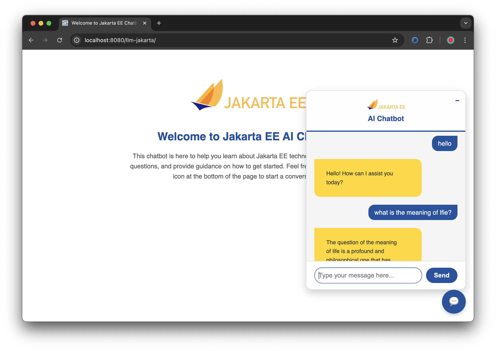

# Jakarta EE AI Chatbot

This Jakarta EE AI Chatbot is designed to help users learn about Jakarta EE technologies, answer their questions, and provide guidance on how to get started. The chatbot integrates with OpenAI's API to provide intelligent, conversational responses.

## Features

- User-friendly interface for interacting with the chatbot.
- AI-powered responses to technical and general questions.
- Built using Jakarta EE, showcasing modern enterprise Java capabilities.

---

## Prerequisites

1. **OpenAI API Key**: You need a valid OpenAI API key to run this chatbot. Save your API key in an environment variable named `OPENAI_API_KEY`.

---

## Setup Instructions

1. **Clone the Repository**: Clone this project to your local machine.
   ```bash
   git clone git@github.com:rokon12/llm-jakarta.git
   cd llm-jakarta
   ```

2. **Set the OpenAI API Key**: Export your OpenAI API key to an environment variable.
   ```bash
   export OPENAI_API_KEY=<your-api-key>
   ```

3. **Build and Run the Application**: Use the following command to clean, package, and start the application in development mode with WildFly.
   ```bash
   ./mvnw clean package wildfly:dev
   ```

4. **Access the Application**: Once the application starts, open your browser and navigate to:
   ```
   http://localhost:8080/llm-jakarta
   ```
5. **Additional Step for RAG Feature (Step 04-06)**: When leveraging the RAG (Retrieval-Augmented Generation) feature, you must specify the directory containing the documents by exporting the following variable

 ```shell
 export LLM_JAKARTA_DOCUMENTS_DIR=<document_dir>
 ```
Replace `<document_dir>` with the path to your documents directory.

**Some of the steps require a database.** To simplify we have added a docker-compose.yml in the "deploy" directory.
 ```shell
 docker-compose up
 ```


---

## Screenshots

### Welcome Page


### Chat Interface


---

## Usage

1. Open the app in your browser using the URL: `http://localhost:8080/llm-jakarta`.
2. Start a conversation by clicking on the chatbot icon in the bottom-right corner.
3. Ask any questions related to Jakarta EE or general queries, and the chatbot will respond with AI-powered insights.

---

## Contributions

We welcome contributions to enhance this chatbot. If you'd like to contribute, feel free to fork the repository, make your changes, and create a pull request.

---

## License

This project is licensed under the [MIT License](LICENSE).
