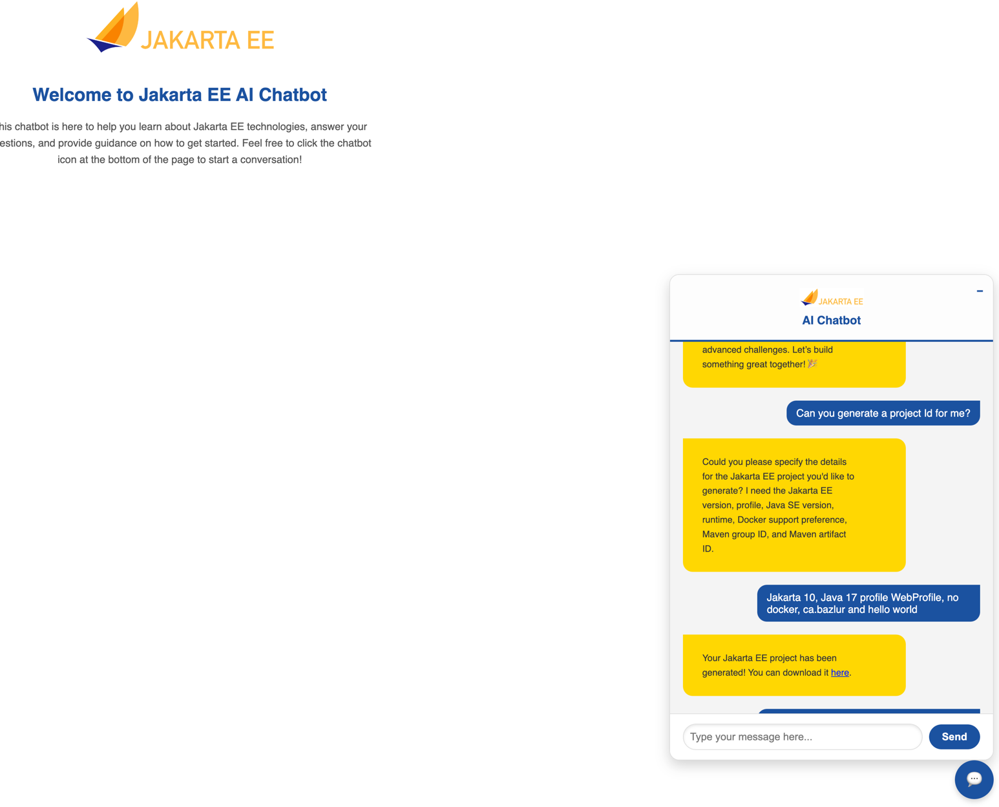

# Jakarta EE Project Generator Tool

The `generate` method in the `JakartaEEProjectGeneratorTool` class creates a Jakarta EE project based on the provided arguments.

## Arguments

- **jakartaVersion**: The Jakarta EE version (e.g., 'Jakarta EE 10', '10'). Extracts numerical values like '10'.
- **profile**: The Jakarta EE profile, mapped as follows:
    - 'Platform' -> 'full'
    - 'Web Profile' or 'Web' -> 'web'
    - 'Core Profile' or 'Core' -> 'core'
      Handles input variations like 'Web Profile' or 'Core' and maps them to their respective keys ('full', 'web', 'core').
- **javaVersion**: The Java SE version (e.g., 'Java SE 17', '17'). Extracts numerical values like '17'.
- **runtime**: The runtime to use, mapped as follows:
    - 'GlassFish' -> 'glassfish'
    - 'Open Liberty' -> 'open-liberty'
    - 'Payara' -> 'payara'
    - 'TomEE' -> 'tomee'
    - 'WildFly' -> 'wildfly'
- **docker**: Whether Docker support is needed ('Yes', 'No'). Handles variations like 'docker support' or 'no docker'.
- **groupId**: The Maven group ID (default: 'org.eclipse'). Use default if not provided.
- **artifactId**: The Maven artifact ID (default: 'jakartaee-hello-world'). Use default if not provided. Normalizes spaces into hyphens.

## Method Description

The method normalizes these inputs, validates them, and generates a project using Maven archetypes. It then zips the project and provides a download URL. If the project configuration is already cached, it retrieves the project from the cache to avoid redundant generation.

Example usage:

